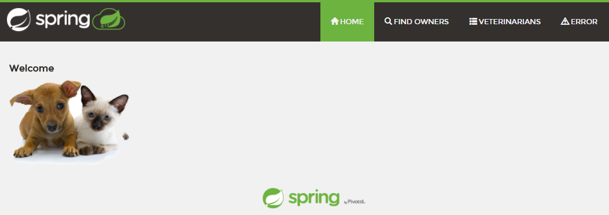
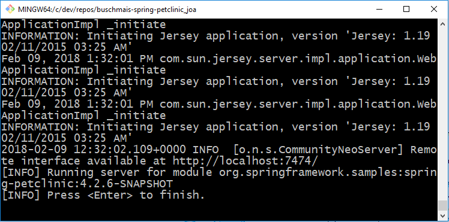
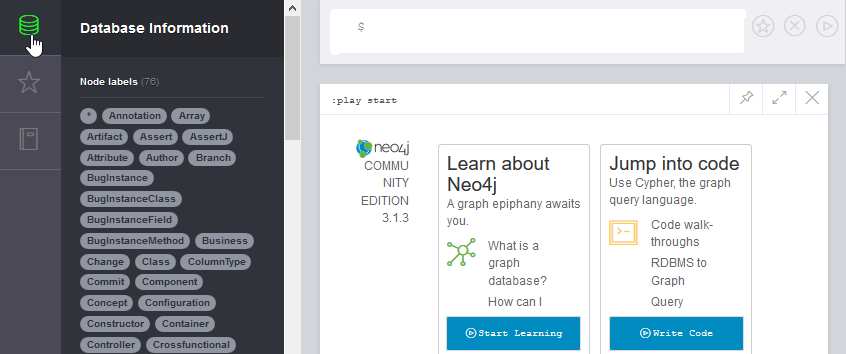

# Spring PetClinic Sample Application with integrated jQAssistant

With this software project, we demonstrate the usage of [jQAssistant](https://jqassistant.org/) and [Neo4j](https://neo4j.com/).

We've integrated jQAssistant in the Maven build of the [Spring PetClinic sample application](https://github.com/spring-projects/spring-petclinic). By doing this, jQAssistant scans various software structures (Java ByteCode, Git commits, JUnit test results and so on) during the build process and stores this information into the Neo4j graph database.

This README shows you, how you can setup this software project by yourself. If you want to integrated jQAssistant in your own project, take a look at [out 101 guide](https://101.jqassistant.org/integrating-jqa-maven-plugin/readme.html)).

## Prerequisites

### Minimum requirements
* Oracle Java Development Kit with Version >=8 ([download](http://www.oracle.com/technetwork/java/javase/downloads/jdk8-downloads-2133151.html))
* Git ([download](https://git-scm.com/downloads))

### Optional
* To produce nice looking diagrams, install GraphViz ([download](https://www.graphviz.org/download/))

## Installing and getting to know the sample application
_Hint: Preferable, you use the Git bash command line or any Unix-like shell for these tasks._

### Understanding the Spring Petclinic application with a few diagrams
The sample application itself is a simple demo for organizing visits of pet owners to vets in a clinic.

* See the presentation on SpeakerDeck: https://speakerdeck.com/michaelisvy/spring-petclinic-sample-application
* Find a running web application here: https://stagemonitor-demo.isys-software.de/

### Downloading and running the `petclinic` web application
First, we want to download the source code of the application with Git, build it with Maven (using `mvnw`) and running the embedded web application server `tomcat7`:
```
	git clone https://github.com/buschmais/spring-petclinic.git
	cd spring-petclinic
    ./mvnw clean install
	./mvnw tomcat7:run
```
You can then access the `petclinic` web application with your browser here: http://localhost:9966/petclinic/

This is what it looks like:



To shutdown the server, press `Ctrl` + `c` on the command line.


## Running jQAssistant / Neo4j locally 

After shutting down the web application server, you can start jQAssistant with this Maven command:
```
	bb
```
You should see the following on the command line:



You can then access the Neo4j browser frontend with the scanned data here: http://localhost:7474

This is what it should look like after clicking the button in the upper left corner (symbol may differ):



## Next steps

Next, you can click on the various labels in the drawer to explore the scanned software data. You can also use the Neo4j guide for jQAssistant (beta) by executing the following command
```
:play http://guides.neo4j.com/jqassistant
```
or by simply clicking this link: http://localhost:7474/browser?cmd=play&arg=http://guides.neo4j.com/jqassistant. The guide will show you some first steps with jQAssistant/Neo4j.

More information e. g. about the scanned Java code can be found in the documentation of jQAssistant: http://buschmais.github.io/jqassistant/doc/1.3.0/#_java_plugin.


## Taking a look at the self-validating, living architecture documentation
After the build, you can find the complete architecture documentation in `target/html/index.html`. The documentation is written in [AsciiDoc](http://asciidoc.org/) and  
* defines the architecture rules in plain text
* translates those rules into Cypher (Neo4j's query language)
* validates the rules by executing the Cypher queries against the actual software
* reports the results back directly into the document.

Please find more information about the various artifacts in the `/docs` directory or [online](https://buschmais.github.io/spring-petclinic/).


  
Have fun!
